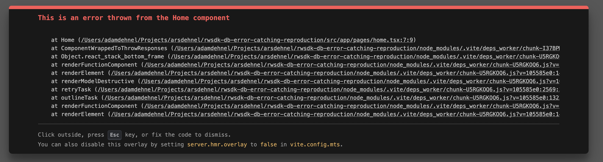

# Error Catching Reproduction

This is a simple reproduction for something that doesn't appear to be working the way the RedwoodSDK docs say they will.  

## Running

I use `pnpm` but you could totally just use `npm`, too. 

```
pnpm install
pnpm dev
```

There is an explicit error I'm throwing in the `/src/app/pages/home.tsx` page component that is a server component.  Based on [these docs](https://docs.rwsdk.com/guides/frontend/error-handling/#server-side-error-handling) it seems that the `worker.tsx` that I have:

```jsx
export default defineApp([
	setCommonHeaders(),
	except((error) => {
		console.error("Servtastic error:", error);
		return <p>Error: {JSON.stringify(error)}</p>;
	}),
	({ ctx }) => {
		// setup ctx here
		ctx;
	},
	render(Document, [route("/", Home)]),
]);
```

I should get a simple paragraph showing my error.  However instead I get a modal overlay with the error.  



In that error message it has this note:

> You can also disable this overlay by setting server.hmr.overlay to false in vite.config.mts.

But when I adjust my Vite config to be like this:

```js
import { cloudflare } from "@cloudflare/vite-plugin";
import { redwood } from "rwsdk/vite";
import { defineConfig } from "vite";

export default defineConfig({
	server: {
		hmr: {
			overlay: false,
		},
	},
	plugins: [
		cloudflare({
			viteEnvironment: { name: "worker" },
		}),
		redwood(),
	],
});
```

I still get the overlay and can't seem to test my custom error handler from the worker.  I do know the `defineApp()` setup is doing _something_ because my terminal shows the result:

```sh
Servtastic error: Error: This is an error thrown from the Home component
    at fn (/chunk-4E2NHG2M.js?v=838fe4d5/virtual:rwsdk:ssr:/node_modules/.vite/deps_ssr/chunk-4E2NHG2M.js:2404:20)
    at resolveErrorDev (/chunk-4E2NHG2M.js?v=838fe4d5/virtual:rwsdk:ssr:/node_modules/.vite/deps_ssr/chunk-4E2NHG2M.js:2382:148)
    at processFullBinaryRow (/chunk-4E2NHG2M.js?v=838fe4d5/virtual:rwsdk:ssr:/node_modules/.vite/deps_ssr/chunk-4E2NHG2M.js:3173:29)
    at progress (/chunk-4E2NHG2M.js?v=838fe4d5/virtual:rwsdk:ssr:/node_modules/.vite/deps_ssr/chunk-4E2NHG2M.js:3369:20) {
  environmentName: 'Server',
  digest: ''
}
```